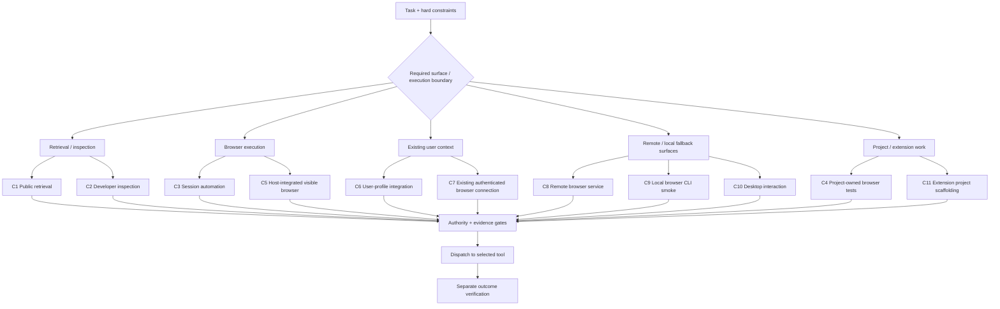

# Browser Tool Compass

**瀏覽器工具羅盤** · [繁體中文](README.zh-tw.md)

> **Version: v0.1.1 (manual)** · Private source repository · No automated release pipeline


**Browser Tool Compass is a decision/router skill for AI agents. It decides which browser-related tool route is appropriate, authorized, and sufficiently evidenced before execution is handed to that tool.**

It is **not browser automation**. It does not click pages, drive tabs, log in, install extensions, launch browsers, or claim that a downstream action succeeded. Its output is a **route decision plus evidence gates**; the selected browser tool performs the actual operation and the task must verify the result separately.

The skill identifier remains `browser-tool-router` for compatibility with existing references.

## Agent mental model

```text
Task request
    ↓
Browser Tool Compass
    ├─ classify required browser surface / execution boundary
    ├─ select a semantic route
    ├─ evaluate authority separately from capability
    └─ require current scoped evidence for required gates
    ↓
Route decision: C1–C11 + PASS / FAIL / BLOCKED / UNKNOWN
    ↓
Selected browser tool executes under its own instructions
    ↓
Task-level outcome verification
```

**Compass chooses and justifies the route; it does not execute the route.**

## Agent route map

The map below is a **semantic classification index for agents**, not a human setup wizard and not an automatic priority tree. The agent still applies hard constraints, authority and evidence gates before dispatch.



This grouping is explanatory only. Route selection is defined by [`SKILL.md`](SKILL.md) and the [routing matrix](references/routing-matrix.md).

## What it does — and does not do

| Browser Tool Compass does | Browser Tool Compass does not |
|---|---|
| Classify a browser task into a semantic C-route | Operate a browser or webpage |
| Check authority, profile/session binding, visibility and evidence requirements | Grant authority because a tool exists or connects |
| Record `PASS`, `FAIL`, `BLOCKED`, `UNKNOWN` and fallback eligibility | Treat installation or transport success as proof of usable browser control |
| Produce a documented route decision before dispatch | Verify that the downstream browser action completed successfully |
| Define portable semantics that environment adapters can implement | Bundle a browser runtime, service, database or executable adapter |

## Primary audience

This repository is primarily consumed by **AI agents, Lead Agents and workflow orchestrators**. Human maintainers may inspect the documents, but the project is designed to supply machine-readable and prompt-readable decision guidance rather than manual browser operation instructions.

## Agent entrypoints

- [Skill entrypoint](SKILL.md): authoritative pre-dispatch decision rules.
- [Routing matrix](references/routing-matrix.md): route-specific evidence, pass signals and stop conditions.
- [Adapter and evidence contract](references/adapter-evidence-contract.md): environment bindings and scoped evidence requirements.
- [Agent extension contract](references/extending-routes.md): how an Agent decides between `BINDING_EXTENSION`, `PROVIDER_REFINEMENT` and `NEW_ROUTE_PROPOSAL` when an environment exposes a new browser capability.
- [Machine-readable route contract](references/route-contract.json): offline semantic metadata, **not an executable router**.
- [Synthetic examples](examples/route-cases.md): illustrative route decisions, **not runtime results**.

[Traditional Chinese overview](README.zh-tw.md) and [skill companion](SKILL.zh-tw.md) are included; English is authoritative.

## Environment extension rule for Agents

When the current environment exposes a new browser tool or capability, the Agent MUST **first attempt to map it to an existing C1–C11 route**.

Use:

- `BINDING_EXTENSION` when an existing route already preserves the required semantics;
- `PROVIDER_REFINEMENT` when the route is correct but a provider needs extra gates;
- `NEW_ROUTE_PROPOSAL` only when no existing C-class can represent the required execution boundary without changing meaning or weakening hard constraints.

A new product, plugin, MCP tool, CLI or provider is **not automatically a new route**. The full Agent maintenance decision record and synchronized file-change contract are defined in [Extending routes and environment bindings](references/extending-routes.md).

## Provider-specific guidance

The contract includes an `openai-chatgpt-browser` binding under C6 for an authorized existing-user Chrome integration. It requires current capability, profile binding, exclusive profile control and applicable provider confirmation. Extension installation alone does not establish availability. Its transport remains opaque and unverified; see [the gates and fallback rules](SKILL.md#gates-fallback-and-stopping).

This independently maintained decision skill does not imply provider endorsement or supply the named provider's runtime.

## Use and boundaries

An approved environment adapter must supply exact available tools and probes before a route can be used. The package itself has no service, database, mandatory framework or executable browser adapter, and requires no build or package installation.

This repository does not install or project the skill into an agent host. Live browser availability and acceptance remain runtime facts that must be established in the active task context.

## Versioning

Current project version: **v0.1.1**.

Versioning is currently **manual**. The maintained version number is written explicitly in the README and is not evidence of an automated GitHub Release, package publication or deployment. `v0.1.1` adds Agent-facing route visualization and environment-extension guidance without changing the existing C1–C11 route semantics.

## Validation and distribution

Static validation should check relative Markdown links, route JSON parsing, route-ID/name consistency, bilingual semantic alignment and that the project still describes a decision/router skill rather than browser automation. Static validation cannot prove authenticated access, application success or absence of all sensitive data.

Distribution is limited to a private source repository. No license grant is supplied; source rights and license terms must be resolved before public release or redistribution. Host installation remains a separately authorized action.
