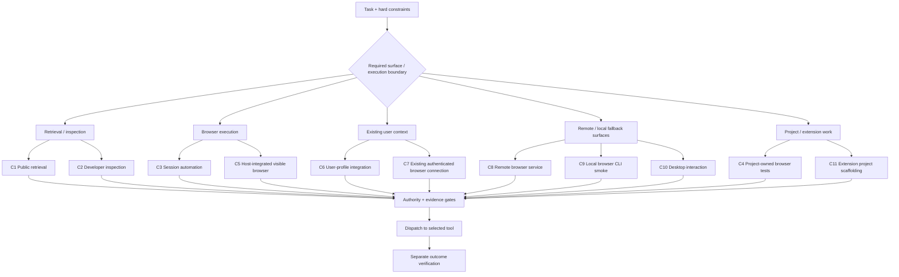

# 瀏覽器工具羅盤

**Browser Tool Compass** · [English](README.md)

> **版本：v0.1.1（手動標註）** · 私人來源倉庫 · 尚無自動化 release pipeline


**Browser Tool Compass 是給 AI agent 使用的 browser-tool decision/router skill。它的工作，是在真正執行瀏覽器操作之前，判斷哪一條瀏覽器工具路徑最適合、已獲授權，而且有足夠的當前證據支持。**

它**不是 browser automation 工具**。它不負責點擊頁面、操作分頁、登入網站、安裝擴充功能、啟動瀏覽器，也不會因為工具連線成功就宣稱下游操作已完成。它的產出是**路由決策與證據關卡**；真正的瀏覽器操作由選定工具負責，任務成果仍須另外驗證。

技能識別碼維持 `browser-tool-router`，以相容既有引用。

## Agent 心智模型

```text
任務需求
    ↓
Browser Tool Compass
    ├─ 分類所需 browser surface / execution boundary
    ├─ 選擇 semantic route
    ├─ 將 authority 與 capability 分開判斷
    └─ 對 required gates 要求當前、範圍內的證據
    ↓
路由決策：C1–C11 + PASS / FAIL / BLOCKED / UNKNOWN
    ↓
交給選定 browser tool，依其自身 instructions 執行
    ↓
任務層級 outcome verification
```

**Compass 負責選路與說明理由，不負責實際走那條路。**

## Agent 路由圖

下圖是提供 **Agent 做 semantic classification 的索引**，不是給人類操作的 setup wizard，也不是自動 priority tree。Agent 在 dispatch 前仍必須套用 hard constraints、authority 與 evidence gates。



這個分組只用來幫助理解；真正 route selection 仍以 [`SKILL.md`](SKILL.md) 與[路由矩陣](references/routing-matrix.zh-tw.md)為準。

## 它會做什麼，以及不會做什麼

| Browser Tool Compass 會做 | Browser Tool Compass 不會做 |
|---|---|
| 將 browser task 分類成 semantic C-route | 直接操作瀏覽器或網頁 |
| 檢查 authority、profile/session binding、visibility 與 evidence requirements | 因為工具存在或連得上，就自動視為取得 authority |
| 記錄 `PASS`、`FAIL`、`BLOCKED`、`UNKNOWN` 與 fallback eligibility | 把 installation/transport success 當成可控制瀏覽器的證明 |
| 在 dispatch 前產生有依據的 route decision | 驗證 downstream browser action 是否真的完成 |
| 定義可攜式語意，讓 environment adapter 實作 | 內建 browser runtime、service、database 或 executable adapter |

## 主要受眾

本 repository 的主要消費者是 **AI Agent、Lead Agent 與 workflow orchestrator**。人類維護者可以閱讀這些文件，但專案目標是提供 machine-readable / prompt-readable 的 decision guidance，而不是人類手動操作瀏覽器的教學。

## Agent 入口

- [Skill 入口](SKILL.md)：權威的 pre-dispatch decision rules。
- [路由矩陣](references/routing-matrix.zh-tw.md)：route-specific evidence、pass signals 與 stop conditions。
- [Adapter 與 evidence 契約](references/adapter-evidence-contract.zh-tw.md)：environment binding 與 scoped evidence requirements。
- [Agent 擴充契約](references/extending-routes.zh-tw.md)：當環境出現新 browser capability 時，Agent 如何判斷 `BINDING_EXTENSION`、`PROVIDER_REFINEMENT` 或 `NEW_ROUTE_PROPOSAL`。
- [Machine-readable route contract](references/route-contract.json)：離線語意 metadata，**不是 executable router**。
- [Synthetic examples](examples/route-cases.zh-tw.md)：示範 route decisions，**不是 runtime results**。

[英文版](README.md)與英文 Skill 文件為權威版本。

## Agent 的 environment extension rule

當目前環境出現新的 browser tool 或 capability 時，Agent MUST **先嘗試把它映射到既有 C1–C11 route**。

分類方式：

- `BINDING_EXTENSION`：既有 route 已能保留所需 semantics；
- `PROVIDER_REFINEMENT`：route 正確，但 provider 需要額外 gates；
- `NEW_ROUTE_PROPOSAL`：只有既有 C-class 無法表示所需 execution boundary，且硬套會改變語意或削弱 hard constraints 時才使用。

新增 product、plugin、MCP tool、CLI 或 provider，**不會自動變成新 route**。完整的 Agent maintenance decision record 與同步檔案變更契約，見 [Agent 擴充契約](references/extending-routes.zh-tw.md)。

## Provider-specific guidance

契約將 `openai-chatgpt-browser` 綁定至 C6，適用於已獲授權的既有使用者 Chrome 整合。使用前須確認 current capability、profile binding、exclusive profile control 與適用的 provider confirmation。僅安裝 extension 不能證明工具可用；transport 維持 opaque/unverified，詳見 [gates/fallback rules](SKILL.md#gates-fallback-and-stopping)。

本 decision skill 獨立維護，不代表 provider endorsement，也不提供該 provider 的 runtime。

## 使用與邊界

使用 route 前，仍須由已核准 environment adapter 提供精確的 available tools 與 probes。本 package 本身沒有 service、database、mandatory framework 或 executable browser adapter，也不需要 build/package installation。

本 repository 不會自行把 skill 安裝或投影到 agent host。Live browser availability 與 acceptance 仍是 active task context 中必須另外建立的 runtime facts。

## 版本管理

目前專案版本：**v0.1.1**。

目前採**手動版本標註**。README 中的版本號不代表已有 automated GitHub Release、package publication 或 deployment。`v0.1.1` 新增 Agent-facing route visualization 與 environment-extension guidance，**沒有改變既有 C1–C11 route semantics**。

## 驗證與散布

Static validation 應檢查 Markdown 相對連結、route JSON parsing、route ID/name 一致性、雙語 semantic alignment，並確認專案仍清楚描述 decision/router skill，而不是 browser automation。Static validation 不能證明 authenticated access、application success 或完全沒有敏感資料。

目前以私人來源 repository 存放，未提供 license grant；公開發布或再散布前須確認來源權利及授權條款。Host installation 仍須另外取得授權。
